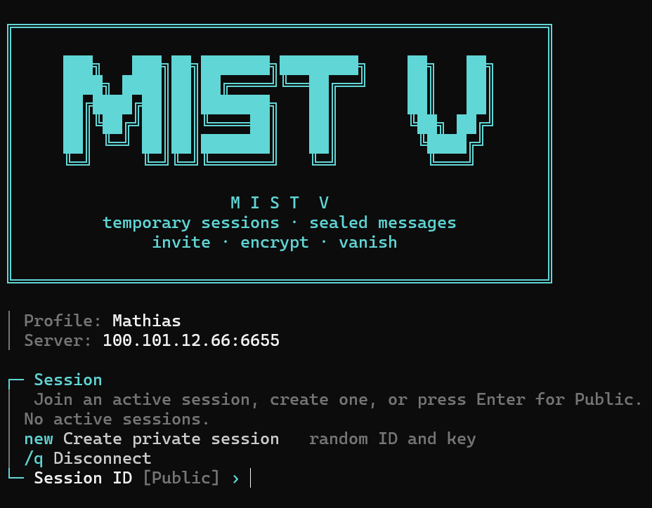
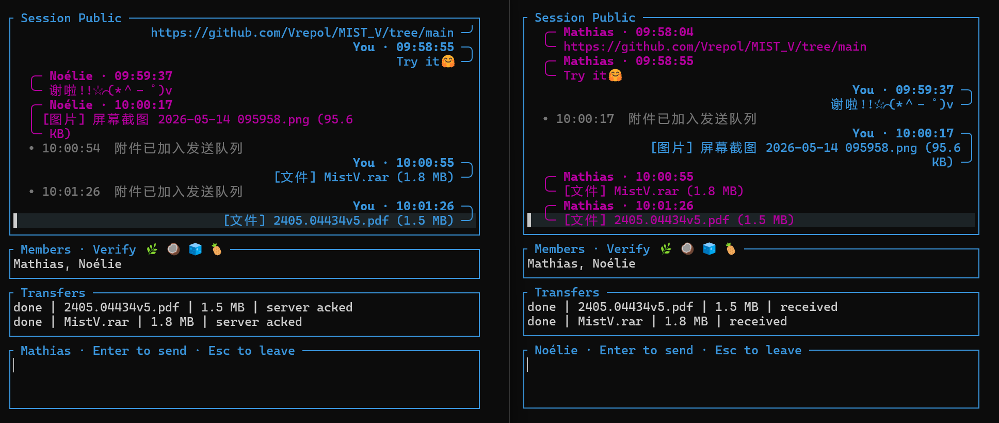

# MIST_V

<p align="center">
  
</p>

> 基于 Rust 的终端加密会话工具，支持临时 Session、邀请码、附件传输，以及端到端加密链路。

## 界面展示


| 登录界面 | 聊天界面 |
| --- | --- |
|  |  |

## 安全声明

这个项目当前更适合被理解为“持续演进中的自研 E2EE 终端聊天实验”，而不是已经经过完整审计、可对标成熟协议栈的安全通信产品。

- 当前版本**无法抗流量分析**
- 当前版本**无法提供“顶级”安全**
- 不应把它视为可直接对标 `TLS`、`Noise`、`Signal`、`MLS` 的成熟方案
- 如果你的威胁模型包含恶意服务端、长期录包、强元数据隐藏、强前向安全或高强度身份校验，当前版本还不够

## 快速开始

### 1. 编译

```bash
git clone https://github.com/Vrepol/MIST_V.git
cd MIST_V
cargo build --release
```

编译完成后可执行文件位于：

- `target/release/MistV-server`
- `target/release/MistV-client`

在 Windows 下对应为 `MistV-server.exe` 和 `MistV-client.exe`。

### 2. 启动一个服务器

最直接的方式：

```bash
cargo run --bin MistV-server -- --port 6655 -k "Password"
```

或者运行编译产物：

```bash
./target/release/MistV-server --port 6655 -k "Password"
```

服务端参数：

| 参数 | 作用 | 默认值 |
| --- | --- | --- |
| `-p, --port` | 监听端口 | `6655` |
| `-k` | 服务端主密码 | `Vrepol` |

如果你不想每次传参，可以直接修改 [src/config.rs](src/config.rs) 里的默认值。

### 3. 启动客户端

```bash
cargo run --bin MistV-client
```

或者：

```bash
./target/release/MistV-client
```

客户端没有命令行参数，启动后直接进入交互式流程。

### 4. 互动内容

客户端启动后会依次让你完成这些步骤：

1. 输入昵称
2. 选择服务器
3. 输入服务端密码，或者直接贴邀请码
4. 输入房间号
5. 输入房间密码

服务器选择支持 4 种方式：

- 直接回车：使用 [src/config.rs](src/config.rs) 里的默认预设服务器
- 输入数字：选择预设服务器列表中的某一项
- 输入 `IP:PORT`：手动连接一个服务端
- 输入 `host`：本机直接拉起一个服务端
- 输入 `/INVITE:...`：通过邀请码加入

### 5. 最快的本地自测方式

如果你只是想在自己机器上先试通一遍，最省事的是用 `host` 模式：

1. 运行 `cargo run --bin MistV-client`
2. 输入昵称
3. 在服务器选择界面输入 `host`
4. 输入本地端口，默认就是 `6655`
5. 输入服务端密码，留空则使用默认值 `Vrepol`
6. 选择一个对外展示地址，或者手动输入一个地址
7. 回到客户端后继续输入房间号和房间密码

这个模式适合单机测试、局域网测试，或者你只是想快速确认功能链路都能跑通。

### 6. 使用方式

进入房间后：

- 直接输入文本并回车发送消息
- 输入 `/send <path>` 发送任意文件
- `Ctrl+X` 智能贴入剪贴板里的文本、图片或文件
- 房主在线时可按 `Ctrl+I` 生成一次性邀请码
- 选中附件后按 `Tab` 打开
- 按 `Esc` 退出当前房间

完整快捷键如下：

| 快捷键 | 功能 |
| --- | --- |
| `Ctrl+X` | 智能贴入剪贴板文本 / 图片 / 文件 |
| `Ctrl+C` | 复制当前选中消息 |
| `Ctrl+Z` | 撤销输入框内容 |
| `Ctrl+A` | 清空输入框 |
| `Ctrl+I` | 生成邀请码 |
| `/send <path>` | 发送任意文件 |
| `←` / `→` | 移动光标 |
| `Ctrl+←` | 向左跳 3 个字符 |
| `Ctrl+→` | 跳到行尾 |
| `↑` / `↓` | 上下选择消息 |
| `Ctrl+↑` | 快速上跳 5 条 |
| `Ctrl+↓` | 快速跳到底部 |
| `Tab` | 打开当前选中的附件 |
| `Esc` | 退出房间 |

### 7. 邀请码机制

邀请码是给“已经在房间里的房主”生成给“新成员”的一次性入口。

使用方式：

1. 房主进入房间后按 `Ctrl+I`
2. 把生成的 `/INVITE:...` 发给对方
3. 新成员启动客户端
4. 在服务器选择界面直接粘贴整段 `/INVITE:...`

当前邀请码：

- 一次性消费
- 默认有效期 10 分钟
- 内部包含服务端地址、邀请码握手材料，以及一个只在客户端本地解房间信息的 `blob_key`

### 8. 附件发送

当前支持两种常见路径：

- 把文件路径写成 `/send <path>`
- 直接用 `Ctrl+X` 从剪贴板粘贴文本、图片或文件

补充说明：

- 图片会自动转换为 PNG 再发送
- 附件会分片传输
- 传输内置 ACK、超时与重试逻辑

## 项目解构

当你已经知道怎么用之后，再看它到底包含什么。软件创建准则可以查看[PRINCIPLE.md](./PRINCIPLE.md)

当前仓库已经有这些能力：

- 终端聊天界面
- 房间系统与邀请码机制
- 客户端到服务端的加密传输
- 房间内消息加密
- 附件分片发送与接收
- 本地 `host` 模式
- 群组密钥演进相关实验实现

默认配置集中在 [src/config.rs](src/config.rs)：

- 默认服务端端口 `DEFAULT_SERVER_PORT`
- 默认服务端密码 `DEFAULT_SERVER_PASSWORD`
- 客户端预设服务器列表 `CLIENT_SERVER_PRESETS`

目录结构：

```text
src/
├── attachments/   # 附件发送、接收、落盘
├── bin/           # client/server 二进制入口
├── client/        # 客户端初始化、握手、收发、会话逻辑
├── crypto/        # 房间加密、邀请码、传输安全、群组密钥演进
├── protocol/      # 协议行格式与解析
├── server/        # 服务端连接、广播、房间、邀请码逻辑
├── transport/     # 包封装、ACK、心跳
├── ui/            # TUI、通知、快捷键、剪贴板
├── util/          # 路径等辅助函数
├── config.rs      # 默认配置
└── lib.rs         # 模块导出与测试
```

二进制入口：

- [src/bin/client.rs](src/bin/client.rs)
- [src/bin/server.rs](src/bin/server.rs)

## 安全性现状

这部分应该放在“会不会用”之后，因为这个项目当前更适合被理解为：

“一个在持续演进中的自研 E2EE 终端聊天实验”，而不是“已经过审计、可直接对标成熟协议栈的安全通信产品”。

先说结论。

### 最重要的限制

- 当前版本不能宣称具备抗流量分析能力
- 当前版本不能宣称具备“顶级”安全
- 当前版本不能宣称已经达到成熟协议栈的工程强度与审计水平

### 现在能提供什么

- 文本消息正文不会以明文形式暴露给服务端
- 附件明文不会直接暴露给服务端
- 房间密码不会原样上传给服务端
- 新成员默认不能解密加入前的旧 epoch
- 被移除成员默认不能解密 rekey 之后的新 epoch
- 单条消息使用独立派生出的 AEAD key / nonce

### 现在还不能宣称什么

- 不能宣称达到 TLS / Noise / Signal / MLS 级别的成熟性
- 不能宣称传输层前向安全已经成立
- 不能宣称恶意服务端场景已经被完整处理
- 不能宣称弱房间口令具备很强的抗离线爆破能力
- 不能宣称流量特征已经被充分隐藏

### 安全边界讨论

如果你的威胁模型是：

- 不想让服务端直接看到聊天正文
- 不想让服务端直接看到附件明文
- 想先做一个可用的终端 E2EE 原型

那当前版本已经有价值。

如果你的威胁模型是：

- 服务端高度恶意
- 攻击者长期录包
- 需要成熟的身份验证、前向安全、后向安全、PCS
- 需要很强的元数据隐藏和抗流量分析能力

那当前版本还不够。

### 分层说明

#### 1. 服务端握手与传输层

普通登录路径：

1. 客户端对服务端密码做 `SHA-256`，得到 `server_pwd_hash`
2. 客户端发明文 `/AUTH_HELLO <client_nonce>`
3. 服务端回明文 `/AUTH_CHALLENGE <server_nonce>`
4. 客户端回明文 `/AUTH_PROOF <HMAC(server_pwd_hash, label, client_nonce, server_nonce)>`
5. 双方用 `HKDF(server_pwd_hash, salt = client_nonce || server_nonce)` 派生会话共享密钥
6. 再按方向分离出 `client->server` 和 `server->client` 两把传输密钥

邀请码登录路径类似：

1. 邀请码中带有 `token_secret` 和本地解 blob 的 `blob_key`
2. 客户端发明文 `/INVITE_HELLO <token_id> <client_nonce>`
3. 服务端回明文 `/INVITE_CHALLENGE <server_nonce>`
4. 客户端回明文 `/INVITE_PROOF <HMAC(token_secret, ...)>`
5. 双方用 `HKDF(token_secret, salt = token_id || client_nonce || server_nonce)` 派生传输层共享密钥

握手完成后，后续链路使用：

- `ChaCha20-Poly1305`
- 单调递增 `seq`
- `seq` 映射到 nonce
- 方向分离密钥
- 基于窗口的重复包检测

这层的作用是防止链路旁路直接读明文，但它还不是标准 TLS，也不具备成熟握手协议提供的前向安全。

#### 2. 房间凭证与房间认证

当前使用 `room_id + room_credential` 本地导出房间秘密：

- `room_key = MD5(room_id || room_credential)` 后重复扩展成 32 字节
- `join_credential = HMAC(room_key[..16], ROOM_JOIN_LABEL)`
- `room_auth_key = HKDF(room_key, salt = ROOM_AUTH_LABEL, info = "room-auth")`

这意味着：

- 服务端默认拿不到原始 `room_credential`
- 服务端拿得到 `room_id` 和 `join_credential`
- 如果房间口令较弱，服务端仍可能离线猜解
- 当前不是 memory-hard KDF，抗爆破能力仍有限

#### 3. 群组消息层

房主创建房间后，本地生成随机 `group_secret(epoch 0)`。消息层随后按 epoch 运作：

1. 用 `group_secret + group_id + epoch` 通过 HKDF 派生 `sender_chain_root`
2. 再按 `sender_id` 派生每个发送者自己的 `chain_key`
3. 每发一条消息，从当前 `chain_key` 派生：
   - 下一跳 `next_chain_key`
   - 本条消息 `aead_key`
   - 本条消息 `nonce`
4. 使用 `ChaCha20-Poly1305` 加密正文

消息头里的 `group_id / epoch / sender_id / msg_no / msg_type` 会作为 AAD 绑定完整性，但不会被加密。

当前效果：

- 每条消息独立 key / nonce
- 同一发送者的消息链单向推进
- 泄露单条消息 key 不会直接反推出别条消息 key

当前限制：

- 如果当前 epoch 的 `group_secret` 泄露，该 epoch 会整体失守
- 还不具备强意义上的 epoch 内前向安全

#### 4. 成员加入 / 退出时的 rekey

成员变化时，当前实现会走一轮 epoch rekey：

1. 每个成员持有一对临时 `X25519` 密钥
2. 成员通过 `/KEY_ANNOUNCE` 广播自己的 `X25519 public key`
3. `KEY_ANNOUNCE` 当前是 `room_auth_key` 做 MAC，不是长期身份签名
4. 提议者生成新的随机 `group_secret`
5. 对每个接收者，提议者执行一次 `X25519 DH`
6. 用 `HKDF(DH, salt = room_auth_key)` 派生包裹密钥
7. 把新的 epoch secret 分别封装进 `/EPOCH_COMMIT`
8. 各成员解开属于自己的 wrapped secret，激活新 epoch
9. 激活新 epoch 后，本地重新生成新的临时 `X25519` 密钥对

这部分带来的安全性质：

- 新加入成员默认拿不到旧 epoch secret
- 被移除成员在新 epoch 生效后默认拿不到后续 epoch

限制也很明确：

- 不是连续前向安全
- `KEY_ANNOUNCE` 还没有长期身份签名绑定
- 当前安全码机制不足以覆盖恶意服务端替换身份的强威胁模型

#### 5. 邀请码保护了什么

当前邀请码格式：

```text
/INVITE:<server_addr_b64>.<token_secret>.<blob_key>
```

其中：

- `token_secret` 用于和服务端完成一次性邀请码握手
- `blob_key` 只在客户端本地使用
- 服务端只存储 `token -> blob_b64`
- `blob_b64` 内部是加密后的 `{room_id, room_credential}`

所以：

- 邀请码不会把房间密码直接交给服务端
- 服务端不能直接解开 blob
- 但邀请码本质上仍然是 bearer capability
- 谁拿到完整邀请码，谁就在有效期内拥有一次使用能力

当前 TTL 为 10 分钟，且一次性消费。

#### 6. 附件加密

附件分成两层：

1. `manifest`
2. `chunk`

其中：

- `manifest` 含 `file_key`、`nonce_base`、文件名、总大小、分片数、哈希
- `manifest` 会作为普通群消息正文加密发送
- 每个附件随机生成一个 `file_key`
- 每个 chunk 用 `ChaCha20-Poly1305(file_key)` 加密
- AAD 会绑定 `group_id / epoch / sender_id / transfer_id / chunk_index / total_chunks`

因此：

- 服务端拿不到文件明文
- 服务端通常也拿不到 `file_key`
- 但服务端仍能看到 chunk 数量、大小和时序

#### 7. 服务端能知道什么

如果服务端是“诚实但好奇”甚至主动分析者，当前它能知道：

- 谁连上了服务器，连接多久，何时断开
- 是密码登录还是邀请码登录
- 房间 `room_id`
- 成员列表、昵称、加入退出事件
- 谁是房主
- 每个包的方向、大小、到达时间、重传与 ACK 节奏
- `/RMSG` 里的 `group_id / epoch / sender_id / msg_no / msg_type`
- 附件的 `transfer_id`、chunk 推进节奏与总体规模
- 邀请码的申请、消费和过期行为

服务端默认看不到：

- 服务端主密码明文
- 房间密码明文
- 文本消息正文
- 附件明文
- 邀请 blob 内部的房间秘密

#### 8. 被动流量分析还能看到什么

链路外部抓包者仍然可以看到：

- TCP 连接建立与断开
- 握手前几帧的明文协议头
- 密文长度和时间间隔
- 每 30 秒 `/ping` 心跳形成的流量指纹
- 文本消息长度与密文长度的相关性
- 附件发送时明显的分片流模式

这也是为什么“流量混淆”仍然在 roadmap 的高优先级里。

## 未来想做

这部分不再和“当前已经有什么”混在一起，而是明确告诉读者下一步准备做什么。

### 高优先级

- [ ] `P0` 增加流量混淆，降低消息长度、时序和行为模式被观察的风险
- [ ] `P1` 软件可信性增强：面向不可信服务器场景，改进当前校验码机制，并考虑基于公钥材料生成可核验安全码
- [ ] `P3` 降低默认暴露端口和部署痕迹带来的识别风险

### 近期改进

- [ ] 适配低带宽服务器：窗口大小 / 分片大小可配置，或者自适应带宽控制
- [ ] 发送者本地附件回显优化，避免服务端回环完整附件
- [ ] 输入框改进，处理中英文混输导致的光标错位
- [ ] IPv6 支持
- [ ] 本地 `host` 模式安全加固，降低同目录服务端二进制被替换后的风险

### 中期重构

- [ ] client / server 单二进制整合
- [ ] 断点续传 / 大文件续发
- [ ] 移动端或 GUI 客户端

### 协议升级方向

- [ ] 长期身份密钥
- [ ] 基于身份公钥的签名绑定
- [ ] 真正可核验的安全码 / 指纹校验
- [ ] 更频繁、更严格的 epoch rekey
- [ ] 更接近 Double Ratchet / MLS / TreeKEM 的群组状态演进

## FAQ

### `alsa-sys` 找不到库

Linux 下安装 `libasound2-dev`，或者在 `Cargo.toml` 中调整相关音频依赖配置。

### PowerShell 显示乱码

建议使用 Windows Terminal，并选择支持较完整字符集的字体。

### 如何跨编译到 Windows

```bash
rustup target add x86_64-pc-windows-gnu
cargo build --release --target x86_64-pc-windows-gnu
```

## 许可证

本项目基于 [MIT License](LICENSE)。
